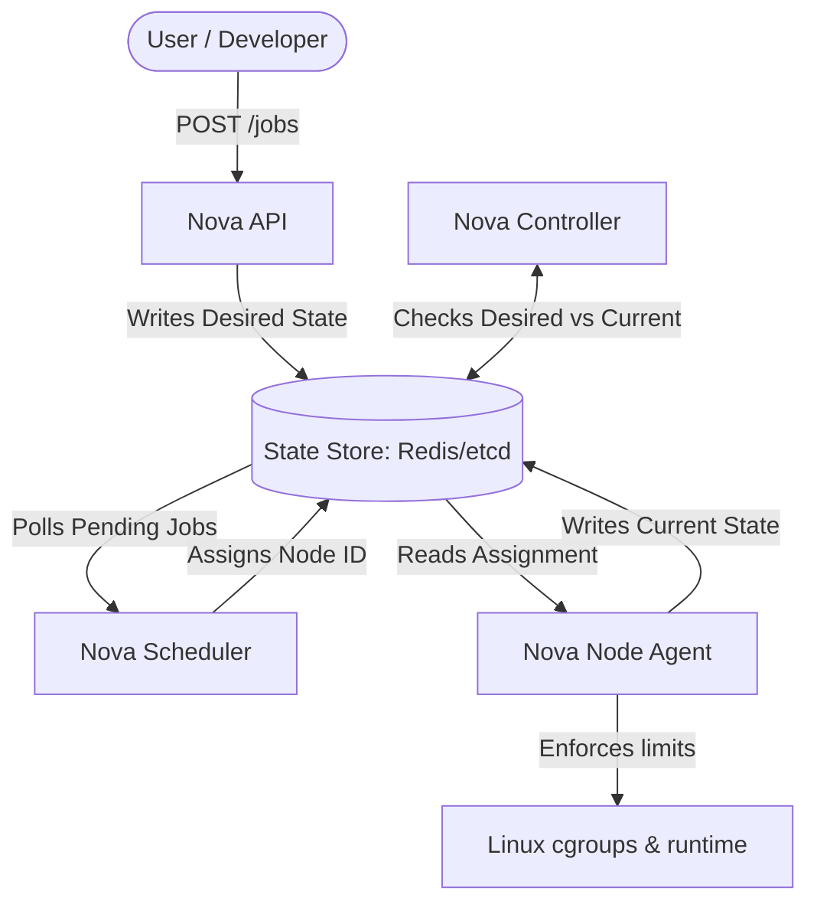
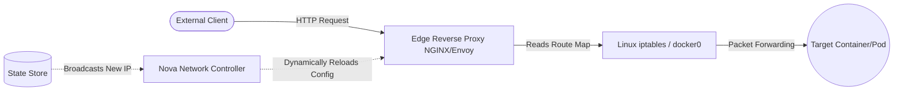

# Nova: Bare-Metal Distributed Compute Orchestrator

[](https://goreportcard.com/report/github.com/yourusername/nova)
[](https://opensource.org/licenses/MIT)

**Nova** is a custom, high-performance orchestration platform built from scratch to manage bare-metal compute resources. 

Moving beyond cloud provider abstractions, Nova is designed to interface directly with the host operating system. It handles decentralized hardware profiling, strictly enforces CPU/Memory limits via kernel features, dynamically routes live network traffic, and maintains system integrity through an automated reconciliation loop.

---

## 💻 Target Environment & Machine Specs

Nova is designed strictly for **Linux** environments. While you can develop the control plane on Windows/macOS, the Node Agent requires a Linux kernel to execute workloads. 

The system relies on three core OS-level technologies:
1. **`cgroups` (Control Groups):** To mathematically throttle CPU cores and RAM allocation per job.
2. **Linux Namespaces:** To isolate the workload's filesystem and process tree.
3. **`iptables` / Virtual Bridges:** To route physical network ingress into isolated container sockets.

---

## 🏗️ System Architecture & Visual Pipelines

Nova splits its operations into two highly decoupled paths: **The Control Pipeline** (managing state) and **The Ingress Pipeline** (managing live user traffic).

### 1. The Control Pipeline (Reconciliation Loop)
This asynchronous loop is the "brain" of Nova. No human intervention is required; the components constantly read from and write to the central State Store to ensure reality matches the user's desires.



### 2. The Ingress Pipeline (Dynamic Data Routing)
When an external user requests a service running inside Nova, this pipeline ensures the physical network packet successfully crosses into the virtual container namespace.



## 🗄️ State Store (Central Database)

Nova uses a **centralized key-value state store** as the single source of truth for the entire cluster.

Instead of communicating directly with one another, every component exchanges information by **reading and writing JSON objects** to the database. This architecture follows the Kubernetes-inspired **Desired State → Reconciliation → Current State** model.

---

### Desired State (Job Request)

When a client submits a workload, the API creates a **Job Intent** in the state store. The Scheduler continuously watches these records to determine where each workload should be executed.

```json
{
  "job_id": "hft-algo-pipeline-01",
  "status": "Pending",
  "image": "ubuntu:22.04",
  "limits": {
    "cpu_cores": 4,
    "ram_gb": 8,
    "gpu_required": false
  },
  "assigned_node": null
}
```

---

### Current State (Node Telemetry)

Each **Node Agent** continuously monitors its host machine and periodically updates the state store with its latest hardware availability. The Scheduler relies on this information to make optimal placement decisions.

```json
{
  "node_id": "worker-node-alpha",
  "ip_address": "192.168.1.15",
  "status": "Healthy",
  "hardware_total": {
    "cpu_cores": 16,
    "ram_gb": 24
  },
  "hardware_available": {
    "cpu_cores": 12,
    "ram_gb": 16
  },
  "last_heartbeat": "2026-06-27T15:30:00Z"
}
```

---

# 🗺️ Development Roadmap

Nova is being built in four incremental phases, ensuring a solid infrastructure foundation before introducing advanced scheduling and networking capabilities.

## Phase 1 • The Brain

- Design the `nova-store` schema.
- Build the `nova-api`.
- Implement CRUD operations for Job Intent.
- Establish the centralized state store.

## Phase 2 • The Brawn (Node Execution)

- Build the `nova-agent` daemon.
- Collect CPU and RAM telemetry from Linux hosts.
- Register worker nodes with the control plane.
- Execute workloads using `cgroups` for resource isolation.

## Phase 3 • The Intelligence (Scheduling & Reconciliation)

- Build the `nova-scheduler`.
- Implement a **Best-Fit Resource Scheduling** algorithm.
- Develop the `nova-controller`.
- Add an infinite reconciliation loop to continuously converge the cluster toward its desired state.

## Phase 4 • The Network (Ingress)

- Build a dynamic reverse proxy configurator.
- Automate service discovery and routing.
- Configure `iptables` rules for host-to-container networking.
- Expose workloads to external clients.

---

# 🛠️ Getting Started

Run the complete Nova control plane locally using Docker Compose.

## 1. Bootstrap the Control Plane

Start the centralized state store and API server.

```bash
git clone https://github.com/yourusername/nova.git

cd nova

docker compose up -d nova-store

go run cmd/nova-api/main.go
```

## 2. Start the Control Loops

Launch the Scheduler and Controller in separate terminals.

```bash
go run cmd/nova-scheduler/main.go

go run cmd/nova-controller/main.go
```

## 3. Register a Worker Node

Start a Node Agent to register your local machine as a worker.

```bash
go run cmd/nova-agent/main.go --node-name="local-worker-1"
```

## 4. Submit a Workload

Submit a test container using the REST API.

```bash
curl -X POST http://localhost:8080/api/v1/jobs \
  -H "Content-Type: application/json" \
  -d '{
    "image": "nginx:latest",
    "limits": {
      "cpu_cores": 2,
      "ram_gb": 4
    }
  }'
```

Nova will automatically:

1. Store the desired state.
2. Select the most suitable worker node.
3. Allocate the required resources.
4. Execute the workload.
5. Continuously reconcile the cluster state.

---

# 📜 License

Distributed under the **MIT License**.

See the `LICENSE` file for more information.
